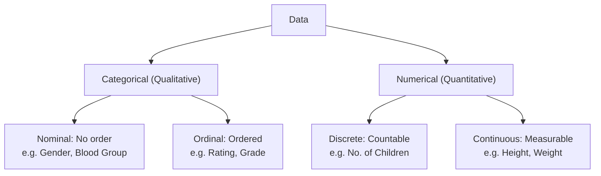
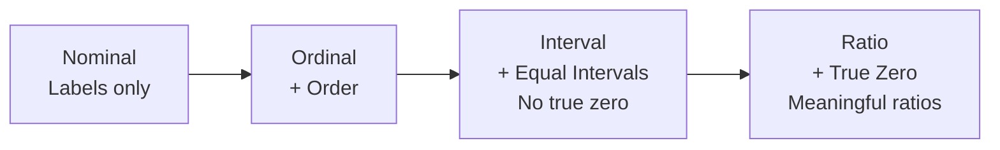
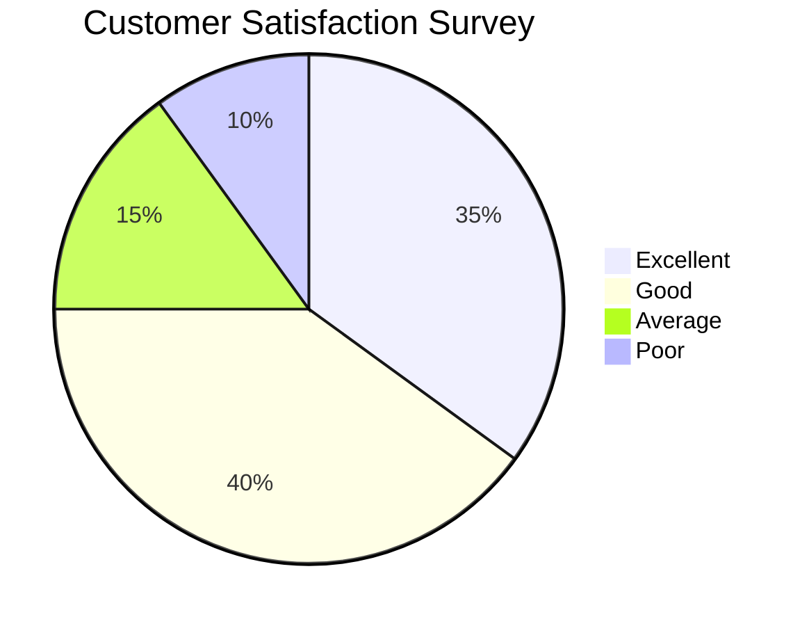
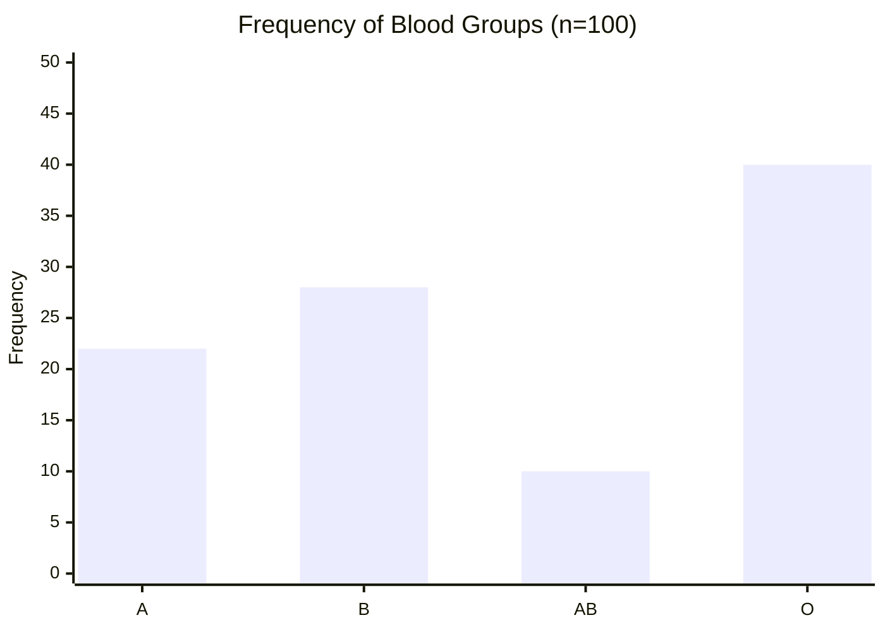
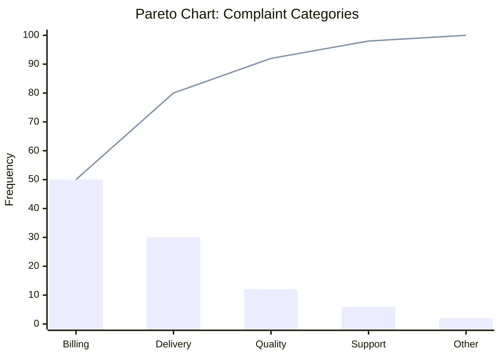
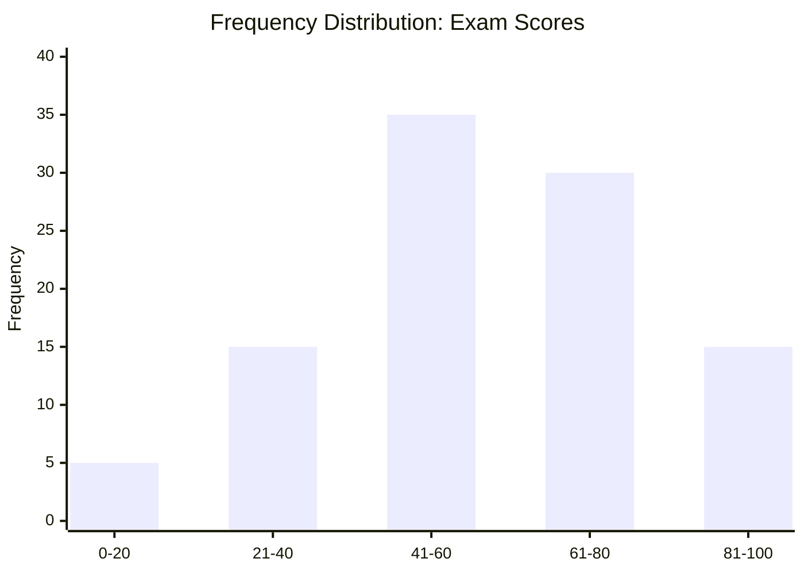
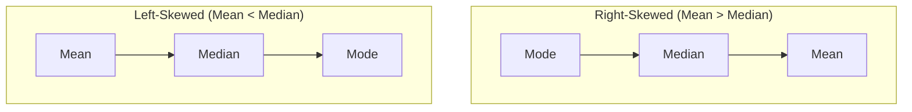
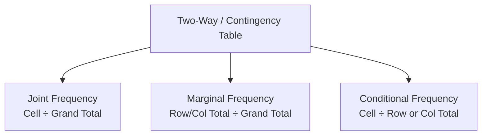
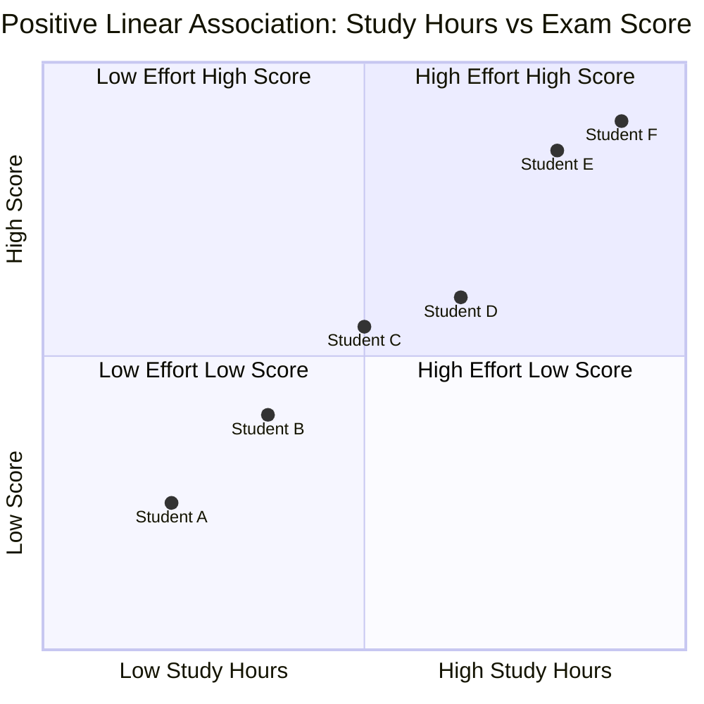
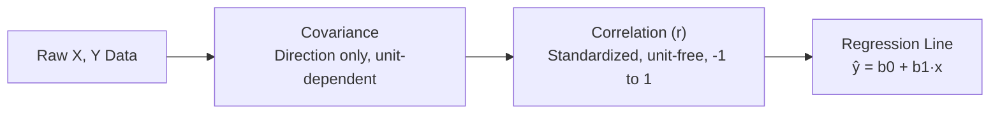

# 📘 IIT Madras BS Degree — Statistics 1: MASTER CLASSBOOK
### Weeks 1–4 | Qualifier Re-Attempt Edition

High-yield, exam-first. No fluff. Every section is built to be scanned, drilled, and recalled under time pressure.

---
---

# WEEK 1 — Introduction & Types of Data

## 📊 Weekly Master Table

| Lesson Code | Topic | Core Weightage | Key Formula / Metric |
|---|---|---|---|
| L1.1 | Basic Definitions — Population, Sample, Variable | **Med** | Parameter (population) vs Statistic (sample) |
| L1.2 | Data & Datasets — Observations vs Variables | **Med** | Rows = Observations · Columns = Variables |
| L1.3 | Classification of Data | **High** | Categorical → Nominal/Ordinal · Numerical → Discrete/Continuous |
| L1.4 | Scales of Measurement | **High** | Nominal < Ordinal < Interval < Ratio |

---

## 🧠 Deep-Dive Concept Blocks

#### L1.1 — Basic Definitions
- **Population** = entire group under study; **Sample** = subset actually measured.
- **Variable** = a characteristic that varies across units; **Data** = recorded values of that variable.
- **Parameter** describes the population; **Statistic** describes the sample — this pair resurfaces in every later week (mean, SD, correlation).
- Exam logic: scenario questions ask "what is the population here?" — anchor on the stated target group, not the sample size mentioned.

#### L1.2 — Data & Datasets
- A dataset is structured as a table: **rows = observations/units**, **columns = variables**.
- Each cell = one measurement of one variable on one observation — never confuse the two axes.
- Cross-sectional data (one point in time) vs. time-series data (over time) is a recurring scenario distinction.
- Exam logic: "how many variables in this dataset?" → count columns, not rows.

#### L1.3 — Classification of Data
- Two master categories: **Categorical (Qualitative)** and **Numerical (Quantitative)**.
- Categorical splits into **Nominal** (no order — gender, blood group) and **Ordinal** (order exists — rating, grade).
- Numerical splits into **Discrete** (countable — number of children) and **Continuous** (measurable — height, time).
- Exam logic: the trap option always tries to reclassify Ordinal as Numerical because it "has order" — order alone does **not** make it numerical.

#### L1.4 — Scales of Measurement
- Four scales, increasing information content: **Nominal → Ordinal → Interval → Ratio**.
- **Nominal**: labels only, no order (city names). **Ordinal**: ranked, unequal/undefined gaps (poor→good).
- **Interval**: ordered + equal gaps, but **no true zero** (Celsius temperature). **Ratio**: ordered + equal gaps + **true zero** (weight, income, age).
- Exam logic: "Temperature in °C" is the #1 trap — it looks numeric but is Interval, not Ratio, because 0°C ≠ "no temperature."

---

## 🗂️ Rapid-Recall Flashcards

#### L1.1
| Flashcard Type | Question / Scenario | Answer / Solution |
|---|---|---|
| Definition | What is the difference between population and sample? | Population = entire group of interest; Sample = subset actually observed. |
| Trick | A survey covers 200 of 10,000 registered voters. What is the population? | All 10,000 registered voters — not the 200 surveyed. |
| Pitfall | Is "average height of sampled students" a parameter or a statistic? | Statistic — it's computed from a sample, not the whole population. |

#### L1.2
| Flashcard Type | Question / Scenario | Answer / Solution |
|---|---|---|
| Definition | In a dataset table, what do rows and columns represent? | Rows = observations/units; Columns = variables. |
| Trick | A dataset has 50 rows and 6 columns. How many variables does it have? | 6 — columns are variables, not rows. |
| Pitfall | Confusing "number of observations" with "number of variables." | Fix the mapping permanently: rows → observations, columns → variables. |

#### L1.3
| Flashcard Type | Question / Scenario | Answer / Solution |
|---|---|---|
| Definition | Classify "Blood Group" and "Number of Cars Owned." | Blood Group = Categorical (Nominal); No. of Cars = Numerical (Discrete). |
| Trick | Is a "1–5 satisfaction rating" numerical just because it uses numbers? | No — it's Ordinal Categorical; numbers are ranked labels, not measurable quantities. |
| Pitfall | Computing a mean directly on raw ordinal category codes. | Risky — Mode/Median are the safer default summaries for ordinal data. |

#### L1.4
| Flashcard Type | Question / Scenario | Answer / Solution |
|---|---|---|
| Definition | Rank the 4 scales from least to most informative. | Nominal → Ordinal → Interval → Ratio. |
| Trick | Why is Celsius temperature NOT a ratio scale? | 0°C isn't "zero temperature," so "20°C is twice as hot as 10°C" is meaningless. |
| Pitfall | Is "Income in ₹" interval or ratio? | Ratio — ₹0 means true absence of income, and ratios (double income) are meaningful. |

---

## 📉 Data Charts & Visualizations

**Classification of Data:**

**Scales of Measurement Hierarchy:**

---

## ⚠️ THE EXAM TRAP — Week 1
**#1 Mistake:** Misclassifying **Ordinal categorical data as Numerical/Interval data** because it's coded with numbers (e.g., a 1–5 rating scale). Rule of thumb: if you can't meaningfully say "value 4 is exactly twice value 2," and it's fundamentally a ranked *category* rather than a measured quantity — it stays **Ordinal Categorical**, never numerical.

---
---

# WEEK 2 — Describing Categorical Data

## 📊 Weekly Master Table

| Lesson Code | Topic | Core Weightage | Key Formula / Metric |
|---|---|---|---|
| L2.1 | Frequency Distributions | **High** | Relative Frequency = f / n |
| L2.2 | Charts of Categorical Data | **High** | Pie angle = % × 3.6° |
| L2.3 | Best Practices in Graphing I | **Med** | Bar chart y-axis must start at 0 |
| L2.4 | Best Practices in Graphing II | **Med** | Avoid 3D / avoid pie with >5–6 categories |
| L2.5 | Mode and Median (Categorical) | **High** | Mode = most frequent category |

---

## 🧠 Deep-Dive Concept Blocks

#### L2.1 — Frequency Distributions
- A frequency table lists each category with count (f), relative frequency (f/n), and percentage.
- Relative frequency enables comparison across datasets of different sizes.
- **Sanity check:** all relative frequencies must sum to 1 (or 100%) — instant MCQ verification tool.
- Exam logic: "find the missing frequency" questions rely on this sum-to-1 property.

#### L2.2 — Charts of Categorical Data
- **Bar chart**: one bar per category, height = frequency/relative frequency, gaps between bars (categories aren't continuous).
- **Pie chart**: slice angle = percentage × 360° (i.e., % × 3.6).
- **Pareto chart**: bars sorted descending + a cumulative % line — highlights the "vital few" categories.
- Exam logic: expect a direct "compute the slice angle given %" or "read frequency off a bar height" numeric question.

#### L2.3 — Best Practices in Graphing (Part 1)
- Bar chart Y-axis **must start at zero** — a non-zero baseline exaggerates visual differences.
- Bars need consistent width and equal spacing to avoid distortion.
- Categories should be ordered meaningfully — by frequency for nominal data, by natural order for ordinal data.
- Exam logic: "spot the misleading chart" — usually a truncated axis is the giveaway.

#### L2.4 — Best Practices in Graphing (Part 2)
- Avoid pie charts once categories exceed ~5–6 — slices become indistinguishable.
- Avoid 3D effects — perspective distorts the perceived proportions.
- Don't use color gradients that imply an order which doesn't exist in nominal data.
- Exam logic: "why is this pie chart misleading?" — usually too many slices or 3D distortion, not an axis issue (axis-truncation traps belong to bar charts, not pies).

#### L2.5 — Mode and Median (Categorical)
- **Mode** = category with highest frequency; valid for **both** nominal and ordinal data. Can be unimodal, bimodal, or absent.
- **Median** for categorical data is defined **only for ordinal** data (a natural order is required) — never for nominal.
- To find the ordinal median: list all observations in order, locate the middle category.
- Exam logic: "can we find the median of favorite-color data?" → No, nominal has no order, so median is undefined.

---

## 🗂️ Rapid-Recall Flashcards

#### L2.1
| Flashcard Type | Question / Scenario | Answer / Solution |
|---|---|---|
| Definition | What must all relative frequencies in a table sum to? | 1, or 100%. |
| Trick | A table shows A = 30%, B = 45%, C = ? Find C. | C = 100 − 30 − 45 = 25%. |
| Pitfall | Reporting a frequency table without checking it sums to 100%. | Always verify the sum — a mismatch signals a computation error. |

#### L2.2
| Flashcard Type | Question / Scenario | Answer / Solution |
|---|---|---|
| Definition | How do you convert a percentage into a pie chart angle? | Angle = Percentage × 3.6° (since 360°/100% = 3.6). |
| Trick | A category has a 25% share. What's its slice angle? | 25 × 3.6 = 90°. |
| Pitfall | Reading a bar chart's frequency straight off a truncated y-axis. | Always check where the y-axis starts before comparing bar heights. |

#### L2.3
| Flashcard Type | Question / Scenario | Answer / Solution |
|---|---|---|
| Definition | Why must a bar chart's y-axis start at zero? | So bar heights stay proportional to true frequency; truncation exaggerates differences. |
| Trick | Two bars look "3× different" but the axis starts at y=50, not 0. What's the real ratio? | Recompute using actual values from y=0 — the visual ratio is misleading. |
| Pitfall | Plotting ordinal categories in random (non-natural) order. | Ordinal categories must follow their natural order (Poor→Fair→Good→Excellent), not frequency order. |

#### L2.4
| Flashcard Type | Question / Scenario | Answer / Solution |
|---|---|---|
| Definition | Name two "bad practice" chart features to avoid. | 3D effects, and pie charts with too many (>5–6) categories. |
| Trick | A pie chart has 12 thin, similarly sized slices — good or bad practice? | Bad — use a bar or Pareto chart instead for clarity. |
| Pitfall | Using a sequential color gradient on nominal categories. | Nominal data has no order — a gradient visually (and wrongly) implies ranking. |

#### L2.5
| Flashcard Type | Question / Scenario | Answer / Solution |
|---|---|---|
| Definition | Can nominal data have a median? | No — median requires order, and nominal data has none. |
| Trick | Ordinal ratings: Poor, Fair, Fair, Good, Excellent (n=5). Find the median. | Sort by order → middle (3rd) value = Fair. |
| Pitfall | Averaging numeric codes assigned to ordinal labels (1=Poor…5=Excellent). | Don't blindly average the codes — the numbers are arbitrary labels; use Mode/Median. |

---

## 📉 Data Charts & Visualizations

**Pie Chart — Categorical Distribution:**

**Bar Chart — Frequency by Category:**

**Pareto Chart — Bars + Cumulative % Line:**

---

## ⚠️ THE EXAM TRAP — Week 2
**#1 Mistake:** Trying to compute a **Median for NOMINAL data** (e.g., "favorite color"). This is mathematically undefined — nominal categories have no order. **Only Mode** is valid for nominal data; **both Mode and Median** are valid for ordinal data. Always check "does this category have a natural order?" before touching the median.

---
---

# WEEK 3 — Describing Numerical Data

## 📊 Weekly Master Table

| Lesson Code | Topic | Core Weightage | Key Formula / Metric |
|---|---|---|---|
| L3.1 | Frequency Tables for Numerical Data | **Med** | Class Width = Range ÷ No. of Classes |
| L3.2 | Mean | **High** | x̄ = Σxᵢ / n |
| L3.3 | Median and Mode | **High** | Median = middle value of sorted data |
| L3.4 | Range, Variance, Standard Deviation | **High** | s² = Σ(xᵢ − x̄)² / (n − 1) |
| L3.5 | Percentiles, Quartiles, IQR | **High** | IQR = Q3 − Q1; Outlier beyond Q1 − 1.5·IQR or Q3 + 1.5·IQR |

---

## 🧠 Deep-Dive Concept Blocks

#### L3.1 — Frequency Tables for Numerical Data
- Large numerical datasets are grouped into class intervals (bins), each with a frequency count.
- **Class Width = Range ÷ desired number of classes**, then rounded up to a clean number.
- The **midpoint** of each class (Lower + Upper)/2 represents that class in further calculations (e.g., estimated grouped mean).
- Exam logic: expect a direct plug-in question — compute class width or midpoint from a given range and class count.

#### L3.2 — Mean
- Mean = sum of all values ÷ n — the "balance point" of the data.
- **Extremely sensitive to outliers** — one extreme value shifts the mean substantially, especially in small samples.
- Population mean (μ) and sample mean (x̄) use the identical formula, differing only in notation and context.
- Exam logic: "mean is skewed by an outlier — which measure of center is more robust?" → Median.

#### L3.3 — Median and Mode
- **Median** = middle value after sorting; if n is even, average the two middle values.
- **Mode** = most frequent value(s); numerical data can be unimodal, bimodal, or have no mode at all.
- Median resists outliers/skew; Mean gets pulled toward the tail in skewed distributions.
- Exam logic — **Skew Rule**: Mean > Median → right-skewed; Mean < Median → left-skewed; Mean ≈ Median → symmetric.

#### L3.4 — Range, Variance, Standard Deviation
- **Range** = Max − Min — simplest measure, but ignores shape and is highly outlier-sensitive.
- **Variance** = average squared deviation from the mean; **sample** variance divides by **(n − 1)** (Bessel's correction), **population** variance divides by **N**.
- **Standard Deviation** = √Variance — same units as the original data (unlike variance, which is in squared units).
- Exam logic: mixing up **n vs (n−1)** is the single biggest calculation error students make in this lesson.

#### L3.5 — Percentiles, Quartiles, IQR
- **Percentile** = value below which a given % of the data falls (90th percentile → 90% of data lies below it).
- **Quartiles**: Q1 (25th percentile), Q2 (median, 50th), Q3 (75th percentile).
- **IQR = Q3 − Q1** = spread of the middle 50% — robust to outliers, unlike Range or SD.
- **Outlier rule**: a value is an outlier if it lies below **Q1 − 1.5×IQR** or above **Q3 + 1.5×IQR** — this defines box-plot whiskers.
- Exam logic: locate the overall median first, then find the median of each half to get Q1/Q3 — don't skip the sorting step.

---

## 🗂️ Rapid-Recall Flashcards

#### L3.1
| Flashcard Type | Question / Scenario | Answer / Solution |
|---|---|---|
| Definition | How do you calculate class width for grouped data? | Class Width = Range ÷ Number of desired classes (round up). |
| Trick | Data ranges 0 to 97, and you want 5 classes. Find the class width. | 97/5 = 19.4 → round up to 20. |
| Pitfall | Using a class's lower boundary as its midpoint. | Midpoint = (Lower + Upper boundary) / 2 — never just the lower limit. |

#### L3.2
| Flashcard Type | Question / Scenario | Answer / Solution |
|---|---|---|
| Definition | Write the formula for sample mean. | x̄ = Σxᵢ / n. |
| Trick | Data: 2, 3, 4, 5, 100. Compare mean vs median. | Mean = 22.8 (heavily pulled up); Median = 4 (unaffected) — shows mean's outlier sensitivity. |
| Pitfall | Assuming the mean always represents "the typical value." | In skewed data the mean is NOT typical — the median better represents the center. |

#### L3.3
| Flashcard Type | Question / Scenario | Answer / Solution |
|---|---|---|
| Definition | How do you find the median when n is even? | Average the two middle values after sorting. |
| Trick | If Mean > Median, what's the skew direction? | Right-skewed (long tail on the positive side). |
| Pitfall | Finding the median without sorting the data first. | The median position formula only works on sorted data — always sort first. |

#### L3.4
| Flashcard Type | Question / Scenario | Answer / Solution |
|---|---|---|
| Definition | Give the formula for sample variance. | s² = Σ(xᵢ − x̄)² / (n − 1). |
| Trick | Why divide by (n − 1), not n, for sample variance? | Bessel's correction — corrects bias when estimating population variance from a sample. |
| Pitfall | Reporting variance as "typical spread in original units." | Variance is in squared units; SD (= √variance) is the interpretable, original-unit measure. |

#### L3.5
| Flashcard Type | Question / Scenario | Answer / Solution |
|---|---|---|
| Definition | What is the formula for IQR? | IQR = Q3 − Q1. |
| Trick | Q1 = 20, Q3 = 50. Beyond what value is a point an upper outlier? | Q3 + 1.5×IQR = 50 + 1.5(30) = 95 → anything above 95 is an outlier. |
| Pitfall | Including the overall median when splitting data to find Q1/Q3 for odd n. | Standard convention: exclude the middle value itself when forming the lower/upper halves. |

---

## 📉 Data Charts & Visualizations

**Frequency Distribution (Histogram-style):**

**Five-Number Summary (Box Plot Anatomy):**

**Skew Direction Rule:**

---

## ⚠️ THE EXAM TRAP — Week 3
**#1 Mistake:** Using the **wrong denominator** in the variance formula — dividing by **N** when the question specifies a **sample** (should be n−1), or vice versa. This single n vs. (n−1) confusion is the most common calculation error across Week 3 assignments. **Always confirm: sample → (n−1); population → N.**

---
---

# WEEK 4 — Association Between Two Variables

## 📊 Weekly Master Table

| Lesson Code | Topic | Core Weightage | Key Formula / Metric |
|---|---|---|---|
| L4.1 | Review of Course | **Low** | Recap: data types → correct association method |
| L4.2 | Two Categorical Variables — Introduction | **Med** | Contingency (two-way) table |
| L4.3 | Relative Frequencies (Categorical Association) | **High** | Conditional % = Cell ÷ Row-or-Column Total |
| L4.4 | Scatterplot | **High** | X = explanatory, Y = response |
| L4.5 | Describing Association | **High** | Direction · Form · Strength |
| L4.6 | Covariance | **High** | Cov(x,y) = Σ(xᵢ−x̄)(yᵢ−ȳ) / (n−1) |
| L4.7 | Correlation | **High** | r = Cov(x,y) / (sx·sy), −1 ≤ r ≤ 1 |
| L4.8 | Fitting a Line (Regression) | **High** | ŷ = b0 + b1x; b1 = r·(sy/sx) |
| L4.9 | Categorical vs Numerical Association | **Med** | Side-by-side boxplots; compare group medians |

---

## 🧠 Deep-Dive Concept Blocks

#### L4.1 — Review of Course
- Recap connects Weeks 1–3: the data type identified in Week 1 dictates which association method applies now.
- Categorical summaries (Mode) feed into two-categorical association tools (contingency tables).
- Numerical summaries (Mean, SD) feed directly into the covariance/correlation formulas.
- Exam logic: expect a mixed-recap question combining "identify the data type" with "pick the correct association tool."

#### L4.2 — Two Categorical Variables — Introduction
- A **contingency (two-way) table** cross-tabulates two categorical variables: rows = one variable's categories, columns = the other's.
- Cell values = **joint frequencies** — the count of observations with that exact combination.
- **Marginal totals** (row/column sums) give each variable's individual frequency distribution.
- Exam logic: "find the marginal total for category X" → sum across the correct row or column, not a single cell.

#### L4.3 — Relative Frequencies (Categorical Association)
- Three types: **Joint** (cell ÷ grand total), **Marginal** (row/col total ÷ grand total), **Conditional** (cell ÷ row-or-col total).
- **Conditional** relative frequencies reveal association: if they differ across categories, the variables are associated.
- Comparing conditional percentages across groups lets you conclude "association exists" or "independence holds."
- Exam logic: "% of smokers among males" is a **conditional** %, not joint — denominator = male total, not grand total.

#### L4.4 — Scatterplot
- Plots one numerical variable (**X, explanatory**) against another (**Y, response**) — each point = one observation.
- Examine three features: **Direction** (positive/negative), **Form** (linear/nonlinear), **Strength** (how tightly points cluster).
- Outliers stand apart from the overall pattern and can strongly distort covariance, correlation, and regression.
- Exam logic: correctly identify which variable is explanatory (X-axis) vs. response (Y-axis) from the scenario wording.

#### L4.5 — Describing Association
- **Direction**: positive (both rise together) or negative (one rises, other falls) — applies only to linear patterns.
- **Form**: linear (straight-line) vs. nonlinear (curved) — correlation/regression formally assume a linear form.
- **Strength**: how closely points hug the trend — qualitative first (strong/moderate/weak), then quantified via correlation.
- Exam logic: a "U-shaped" scatterplot is **nonlinear association**, not "no association" — correlation would misleadingly read near zero here.

#### L4.6 — Covariance
- Measures the **direction** of linear association between two numerical variables: positive, negative, or near-zero.
- Formula: **Cov(x,y) = Σ(xᵢ−x̄)(yᵢ−ȳ) / (n−1)** for sample covariance.
- Magnitude depends entirely on the **units** of X and Y — not comparable across different variable pairs.
- Exam logic: a "large" covariance does not by itself mean "strong" association — it may just reflect large-scale units.

#### L4.7 — Correlation
- **r = Cov(x,y) / (sx × sy)** — standardized covariance; always bounded **−1 ≤ r ≤ 1**.
- r near ±1 → strong linear association; r near 0 → weak/no **linear** association.
- **Unit-free**, symmetric (r(x,y) = r(y,x)), and measures **only linear** association — a strong nonlinear pattern can still give r ≈ 0.
- Exam logic: "Correlation ≠ Causation," and "r = 0 ≠ no relationship" (only no *linear* relationship) — two classic conceptual traps.

#### L4.8 — Fitting a Line (Regression)
- Least-squares line: **ŷ = b0 + b1x**, chosen to minimize the sum of squared residuals (actual − predicted).
- **Slope: b1 = r × (sy / sx)** — directly links correlation to the regression slope.
- **Intercept: b0 = ȳ − b1·x̄** — the line always passes through the point (x̄, ȳ).
- Exam logic: compute ŷ for a given x, or interpret the slope as "for each 1-unit rise in X, Y changes by b1 units on average."

#### L4.9 — Categorical vs. Numerical Association
- To study association between one categorical and one numerical variable, compare the numerical variable's distribution **across** the categorical groups.
- **Side-by-side boxplots** are the standard visual — compare medians, spreads, and outliers across groups.
- Substantially different group medians/means signal an association between the grouping variable and the numerical outcome.
- Exam logic: read "which group has the higher median" or "which group shows more variability" straight off a described boxplot.

---

## 🗂️ Rapid-Recall Flashcards

#### L4.1
| Flashcard Type | Question / Scenario | Answer / Solution |
|---|---|---|
| Definition | What's the purpose of a review lesson before new content? | Consolidates data-type and summary-statistic knowledge needed to pick the correct association method. |
| Trick | Given mixed variable types in a scenario, what's the first step? | Identify each variable's type — it decides whether you need a contingency table, scatterplot, or boxplot. |
| Pitfall | Jumping straight to correlation/covariance without checking both variables are numerical. | Covariance/correlation apply ONLY to two numerical variables — never to categorical data. |

#### L4.2
| Flashcard Type | Question / Scenario | Answer / Solution |
|---|---|---|
| Definition | What is a contingency table? | A cross-tabulation showing joint frequency counts for two categorical variables. |
| Trick | Given a contingency table, how do you find one variable's overall distribution? | Use the marginal totals (row or column sums), not individual cells. |
| Pitfall | Confusing a cell frequency with a marginal total. | Cell = joint count for one row-column combo; marginal = the full row/column total. |

#### L4.3
| Flashcard Type | Question / Scenario | Answer / Solution |
|---|---|---|
| Definition | Differentiate joint, marginal, and conditional relative frequency. | Joint = cell/grand total; Marginal = row(or col) total/grand total; Conditional = cell/row(or col) total. |
| Trick | "% of employees who are managers among females" — which type is this? | Conditional relative frequency (denominator = female total, not grand total). |
| Pitfall | Using the grand total as denominator when a conditional % was asked for. | Always match the denominator to the stated condition ("among X" → X's total is the denominator). |

#### L4.4
| Flashcard Type | Question / Scenario | Answer / Solution |
|---|---|---|
| Definition | On a scatterplot, which variable goes on the X-axis? | The explanatory (independent) variable. |
| Trick | Points scattered with no visible pattern — what does this suggest? | Little to no association between the two variables. |
| Pitfall | Swapping explanatory/response variables against the stated scenario. | Always place the "predictor/cause" on X and the "outcome/effect" on Y. |

#### L4.5
| Flashcard Type | Question / Scenario | Answer / Solution |
|---|---|---|
| Definition | Name the three features used to describe scatterplot association. | Direction, Form, Strength. |
| Trick | A scatterplot shows a clear U-shape — "no association" or "nonlinear association"? | Nonlinear (strong) association — NOT "no association"; r would misleadingly look near zero. |
| Pitfall | Describing a nonlinear pattern using "positive/negative direction." | Direction only applies to linear trends — nonlinear patterns need shape terms (U-shaped, curved). |

#### L4.6
| Flashcard Type | Question / Scenario | Answer / Solution |
|---|---|---|
| Definition | Write the sample covariance formula. | Cov(x,y) = Σ(xᵢ−x̄)(yᵢ−ȳ) / (n−1). |
| Trick | Cov(Height in cm, Weight in kg) = 150. Is this a "strong" relationship? | Can't say — covariance is unit-dependent; magnitude alone doesn't indicate strength. |
| Pitfall | Comparing covariance across two different variable pairs to judge "which is more related." | Invalid — different units make covariances non-comparable; use correlation instead. |

#### L4.7
| Flashcard Type | Question / Scenario | Answer / Solution |
|---|---|---|
| Definition | Give the range of the correlation coefficient r. | −1 ≤ r ≤ 1. |
| Trick | r = 0 between X and Y — does this mean they're unrelated? | Not necessarily — r=0 only rules out a LINEAR relationship; a nonlinear one could still exist. |
| Pitfall | Concluding causation from a high correlation value. | Correlation ≠ Causation — a lurking/confounding variable could explain it. |

#### L4.8
| Flashcard Type | Question / Scenario | Answer / Solution |
|---|---|---|
| Definition | Write the least-squares regression equation form. | ŷ = b0 + b1x. |
| Trick | Given r=0.8, sy=10, sx=5, find the slope b1. | b1 = r×(sy/sx) = 0.8×(10/5) = 1.6. |
| Pitfall | Using the regression line to predict far outside the observed X range. | Extrapolation is unreliable — the linear pattern may not hold outside the data range. |

#### L4.9
| Flashcard Type | Question / Scenario | Answer / Solution |
|---|---|---|
| Definition | What visualization compares a numerical variable across categorical groups? | Side-by-side boxplots. |
| Trick | Two groups' boxplots have very different medians with minimal overlap — what does this suggest? | A strong association between the categorical variable and the numerical outcome. |
| Pitfall | Using covariance/correlation to measure categorical-numerical association. | Invalid — those require two numerical variables; use grouped summary stats/boxplots instead. |

---

## 📉 Data Charts & Visualizations

**Contingency Table → Relative Frequency Types:**

**Scatterplot Pattern — Positive Linear Association:**

**Covariance → Correlation → Regression Pipeline:**

---

## ⚠️ THE EXAM TRAP — Week 4
**#1 Mistake:** Applying **covariance/correlation to categorical variables**, or misreading **r ≈ 0 as "no relationship at all"** when the true pattern is strong but **nonlinear**. Also watch for: forgetting that **correlation is unit-free but covariance is not** — never compare raw covariance values across variable pairs with different units.

---
---

# ✅ End of Weeks 1–4

Every lesson code from L1.1 through L4.9 is covered: master table → deep-dive → flashcards → visualization → exam trap, in that order, per week. Drill the flashcards first on a re-attempt — they're built to expose exactly where assignments go wrong.
